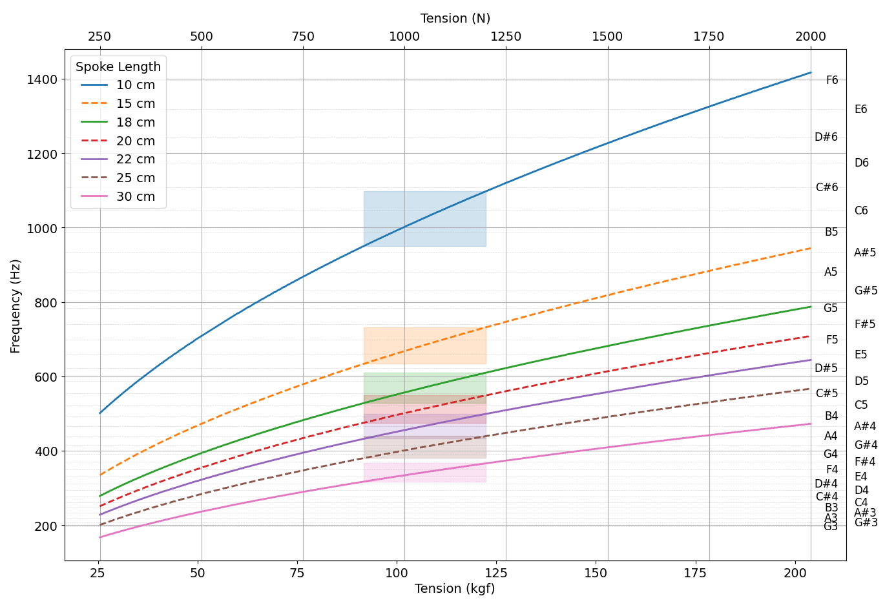

# spoke pluck tension
Measure spoke tension by the sound. Work in progress.

## Getting started
```sh
git clone https://github.com/lucas-mior/spoke_pluck_tension
cd spoke_pluck_tension
pip install -r requirements.txt
python app.py
```

## Dependencies
- python and libraries declared in `requirements.txt`
- make
- a C compiler
- rtaudio

## How are sound frequency and spoke tension related?
When you pluck a spoke, it ressonates at a frequency given by
the following:

```python
def frequency(tension, length=length0):
    return np.sqrt(tension / mu_steel) / (2 * length)
```
Where `length` is the spoke length and `mu_steel` is the longitudinal mass
density.


This graph shows the relation between tension and frequency for spokes of 2mm
diameter of multiple lengths. The highlighted areas are the typical optimal
values.

## Spokes parameters
You should set the spoke parameters in `spokes.py`. The most relevant are:
- `SPOKE_DIAMETER`: Diameter of your spokes (currently only works for plain
  gauge spokes).
- `SPOKE_LENGTH`: Length of the spoke, from the nipple bottom until it crosses
   another spoke, if [interlaced](https://www.youtube.com/watch?v=-fX5mAOzJVU&pp=ugMICgJwdBABGAHKBRBzcG9rZXMgaW50ZXJsYWNl)),
   or until the hub flange (if not interlaced).

# Extra details
This program works better in very quiet environments.  I have tested the app
only with my own (bad) internal computer mic and for a specific spoke
configuration, so it may need some tweaking to work properly with your setup.
Also, you shoud not rely only on this program's measurements when
tensioning/truing a wheel. Combine it with a traditional spring tensiometer,
your own ears and you hands feel. From what I've tested, this program is
accurate and precise for high tensions (> 800N). Lower tension measurements tend
to be more error prone.

## Dive deeper into the subject
- [Blog post about measuring spoke tension](https://savetheneurons.blogspot.com/2019/01/your-spoke-tension-meter-is-probably.html)
