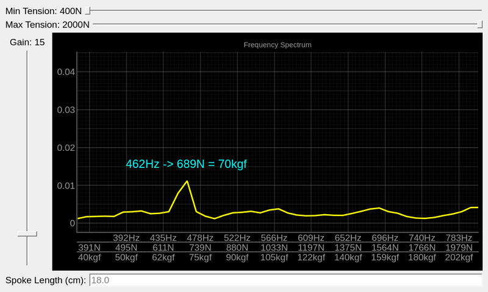

# spoke pluck tension
Measure spoke tension by the sound. Work in progress.

## Getting started
```sh
git clone https://github.com/lucas-mior/spoke_pluck_tension
cd spoke_pluck_tension
pip install -r requirements.txt
python app.py
```

## Dependencies
- python and libraries declared in `requirements.txt`
- make
- a C compiler
- rtaudio

## How are sound frequency and spoke tension related?
When you pluck a spoke, it ressonates at a frequency given by
the following:

```python
def frequency(tension, length=length0):
    return np.sqrt(tension / mu_steel) / (2 * length)
```
Where `length` is the spoke length and `mu_steel` is the longitudinal mass
density.


This graph shows the relation between tension and frequency for spokes of 2mm
diameter of multiple lengths. The highlighted areas are the typical optimal
values.

### Screenshot


## Spokes parameters
You should set the spoke parameters in `spokes.py`. The most relevant are:
- `SPOKE_DIAMETER`: Diameter of your spokes (currently only works for plain
  gauge spokes).
- `SPOKE_LENGTH`: Length of the spoke, from the nipple bottom until it crosses
   another spoke, if [interlaced](https://www.youtube.com/watch?v=-fX5mAOzJVU&pp=ugMICgJwdBABGAHKBRBzcG9rZXMgaW50ZXJsYWNl)),
   or until the hub flange (if not interlaced).

# Extra details
This program works best in quiet environments, but I found that even with
significant background noise, it can perform well by holding the rim against a
wooden table where your computer or microphone is placed. Using only the air as
a sound conductor is less effective.

I have tested the app only with my (poor-quality) internal computer microphone
and for a specific spoke configuration, so you may need to tweak it to work
properly with your setup. Also, you should not rely solely on this program’s
measurements when tensioning or truing a wheel. Combine it with a traditional
spring tensiometer, your own ears, and your hands feel.

From my tests, this program is accurate and precise for high tensions (above 800
N). Measurements at lower tensions tend to be more error-prone.

## Dive deeper into the subject
- [Blog post about measuring spoke tension](https://savetheneurons.blogspot.com/2019/01/your-spoke-tension-meter-is-probably.html)
- [Sheldon Brown on checking spoke tension by ear](https://www.sheldonbrown.com/spoke-pitch.html)
- [Comparison of measurements of bicycle spoke tension using a mechanical tensiometer and musical pitch](https://www.ihpva.org/HParchive/PDF/hp53-2002.pdf)
- [Forum thread about proper measurement](https://www.bikegremlin.net/threads/how-to-measure-spoke-tension-properly.370/)
